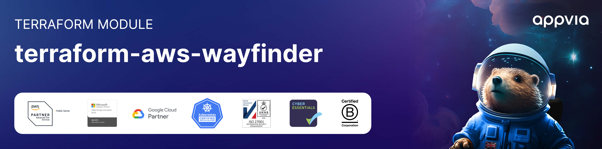

<!-- markdownlint-disable -->

<a href="https://www.appvia.io/"></a><br/><p align="right"> <a href="https://registry.terraform.io/modules/appvia/wayfinder/aws/latest"></a> <a href="https://github.com/appvia/terraform-aws-wayfinder/releases/latest"></a> <a href="https://appvia-community.slack.com/join/shared_invite/zt-1s7i7xy85-T155drryqU56emm09ojMVA#/shared-invite/email"></a> <a href="https://github.com/appvia/terraform-aws-wayfinder/graphs/contributors"></a> </p>

<!-- markdownlint-restore -->
<!--
  ***** CAUTION: DO NOT EDIT ABOVE THIS LINE ******
-->

## Description

The "terraform-aws-wayfinder" Terraform Module can be used to provision and manage a licensed edition of [Appvia Wayfinder](https://www.appvia.io/wayfinder) on AWS.

## Requirements

To run this module, you will need the following:

1. Product Licence Key & Instance ID. Request a free licence key from the [Appvia Portal](https://portal.appvia.io/trial?utm_source=terraform-aws-wayfinder).
2. (Optional) IDP App configuration details: Wayfinder integrates with an IDP for managing user access. You will need a valid Client ID, Client Secret and Server URL (or Azure Tenant ID) for setup. This does not need to be defined initially within Terraform, and can also be setup within the product. Wayfinder can provision a `localadmin` user for initial access if no IDP details are provided.
3. A public Route53 DNS Zone: This module will create DNS records for the Wayfinder API and UI endpoints, and performs a DNS01 challenge via the LetsEncrypt Issuer for valid domain certificates.
4. Existing VPC and Subnets: This module will deploy an EKS Cluster and so requires an existing VPC with outbound internet connectivity. Public ingress is not required, both EKS and Wayfinder ingress can be configured with an internal endpoint.
5. Network Resource Tags:
   1. Public Subnets should have the tag `"kubernetes.io/role/elb" = 1`
   2. Private Subnets should have the tag `"kubernetes.io/role/internal-elb" = 1`

## Deployment

Please see the [examples](./examples) directory to see how to deploy this module. To get up and running quickly with minimal pre-requisites, use the [`quickstart`](./examples/quickstart) example.

### (Optional) Connecting to an Identity Provider

Wayfinder integrates with an IDP for managing user access. You will need a valid Client ID, Client Secret and Server URL (or Azure Tenant ID).

This configuration is optional within Terraform, and can also be setup within the product. Please view the documentation for more information: https://docs.appvia.io/wayfinder/admin/auth

The Authorized Redirect URI for the IDP Application should be set to: `https://${wayfinder_domain_name_api}/oauth/callback`

**Note:** If you are using Azure Active Directory, you must:

1. Set `azureTenantId` to your Azure Tenant ID (`serverUrl` is not required)
2. Set the IDP type to `aad`

#### Example: Generic IDP Configuration

```hcl
wayfinder_idp_details = {
    type         = "generic"
    clientId     = "IDP-APP-CLIENT-ID"
    clientSecret = "IDP-APP-CLIENT-SECRET"
    serverUrl    = "https://example.okta.com" # Or "https://example.auth0.com/"
}
```

#### Example: Azure AD IDP Configuration

```hcl
wayfinder_idp_details = {
    type          = "aad"
    clientId      = "IDP-APP-CLIENT-ID"
    clientSecret  = "IDP-APP-CLIENT-SECRET"
    azureTenantId = "12345678-1234-1234-1234-123456789012"
}
```

## Updating Docs

The `terraform-docs` utility is used to generate this README. Follow the below steps to update:

1. Make changes to the `.terraform-docs.yml` file
2. Fetch the `terraform-docs` binary (https://terraform-docs.io/user-guide/installation/)
3. Run `terraform-docs markdown table --output-file ${PWD}/README.md --output-mode inject .`

<!-- BEGIN_TF_DOCS -->
## Providers

| Name | Version |
|------|---------|
| <a name="provider_aws"></a> [aws](#provider\_aws) | >= 5.34 |
| <a name="provider_helm"></a> [helm](#provider\_helm) | >= 2.9.0 |
| <a name="provider_kubectl"></a> [kubectl](#provider\_kubectl) | >= 2.0 |
| <a name="provider_random"></a> [random](#provider\_random) | >= 3.5 |

## Inputs

| Name | Description | Type | Default | Required |
|------|-------------|------|---------|:--------:|
| <a name="input_clusterissuer_email"></a> [clusterissuer\_email](#input\_clusterissuer\_email) | The email address to use for the cert-manager cluster issuer. | `string` | n/a | yes |
| <a name="input_dns_zone_arn"></a> [dns\_zone\_arn](#input\_dns\_zone\_arn) | The AWS Route53 DNS Zone ARN to use (e.g. arn:aws:route53:::hostedzone/ABCDEFG1234567). | `string` | n/a | yes |
| <a name="input_vpc_id"></a> [vpc\_id](#input\_vpc\_id) | The VPC ID for the Wayfinder EKS Cluster to be built within. | `string` | n/a | yes |
| <a name="input_wayfinder_domain_name_api"></a> [wayfinder\_domain\_name\_api](#input\_wayfinder\_domain\_name\_api) | The domain name to use for the Wayfinder API (e.g. api.wayfinder.example.com). | `string` | n/a | yes |
| <a name="input_wayfinder_domain_name_ui"></a> [wayfinder\_domain\_name\_ui](#input\_wayfinder\_domain\_name\_ui) | The domain name to use for the Wayfinder UI (e.g. portal.wayfinder.example.com). | `string` | n/a | yes |
| <a name="input_wayfinder_instance_id"></a> [wayfinder\_instance\_id](#input\_wayfinder\_instance\_id) | The instance ID to use for Wayfinder. | `string` | n/a | yes |
| <a name="input_wayfinder_licence_key"></a> [wayfinder\_licence\_key](#input\_wayfinder\_licence\_key) | The licence key to use for Wayfinder. | `string` | n/a | yes |
| <a name="input_access_entries"></a> [access\_entries](#input\_access\_entries) | Map of access entries to add to the cluster. This is required if you use a different IAM Role for Terraform Plan actions. | <pre>map(object({<br/>    kubernetes_groups = optional(list(string))<br/>    principal_arn     = string<br/>    policy_associations = optional(map(object({<br/>      policy_arn = string<br/>      access_scope = object({<br/>        namespaces = optional(list(string))<br/>        type       = string<br/>      })<br/>    })))<br/>  }))</pre> | `{}` | no |
| <a name="input_aws_ebs_csi_driver_addon_version"></a> [aws\_ebs\_csi\_driver\_addon\_version](#input\_aws\_ebs\_csi\_driver\_addon\_version) | The version to use for the AWS EBS CSI driver. | `string` | `"v1.31.0-eksbuild.1"` | no |
| <a name="input_aws_vpc_cni_addon_version"></a> [aws\_vpc\_cni\_addon\_version](#input\_aws\_vpc\_cni\_addon\_version) | AWS VPC CNI Addon version to use. | `string` | `"v1.18.5-eksbuild.1"` | no |
| <a name="input_cluster_enabled_log_types"></a> [cluster\_enabled\_log\_types](#input\_cluster\_enabled\_log\_types) | List of log types to enable for the EKS cluster. | `list(string)` | <pre>[<br/>  "api",<br/>  "audit",<br/>  "authenticator",<br/>  "controllerManager",<br/>  "scheduler"<br/>]</pre> | no |
| <a name="input_cluster_endpoint_public_access_cidrs"></a> [cluster\_endpoint\_public\_access\_cidrs](#input\_cluster\_endpoint\_public\_access\_cidrs) | List of CIDR blocks which can access the Amazon EKS API server endpoint. | `list(string)` | <pre>[<br/>  "0.0.0.0/0"<br/>]</pre> | no |
| <a name="input_cluster_security_group_additional_rules"></a> [cluster\_security\_group\_additional\_rules](#input\_cluster\_security\_group\_additional\_rules) | List of additional security group rules to add to the cluster security group created. Set `source_node_security_group = true` inside rules to set the `node_security_group` as source. | `any` | `{}` | no |
| <a name="input_cluster_version"></a> [cluster\_version](#input\_cluster\_version) | The Kubernetes version to use for the EKS cluster. | `string` | `"1.30"` | no |
| <a name="input_coredns_addon_version"></a> [coredns\_addon\_version](#input\_coredns\_addon\_version) | CoreDNS Addon version to use. | `string` | `"v1.11.3-eksbuild.1"` | no |
| <a name="input_create_localadmin_user"></a> [create\_localadmin\_user](#input\_create\_localadmin\_user) | Whether to create a localadmin user for access to the Wayfinder Portal and API. | `bool` | `true` | no |
| <a name="input_disable_internet_access"></a> [disable\_internet\_access](#input\_disable\_internet\_access) | Whether to disable internet access for EKS and the Wayfinder ingress controller. | `bool` | `false` | no |
| <a name="input_disable_local_login"></a> [disable\_local\_login](#input\_disable\_local\_login) | Whether to disable local login for Wayfinder. Note: An IDP must be configured within Wayfinder, otherwise you will not be able to log in. | `bool` | `false` | no |
| <a name="input_ebs_csi_kms_cmk_ids"></a> [ebs\_csi\_kms\_cmk\_ids](#input\_ebs\_csi\_kms\_cmk\_ids) | List of KMS CMKs to allow EBS CSI to manage encrypted volumes. This is required if EBS encryption is set at the account level with a default KMS CMK. | `list(string)` | `[]` | no |
| <a name="input_eks_encrypted_sc_type"></a> [eks\_encrypted\_sc\_type](#input\_eks\_encrypted\_sc\_type) | The storage class type to use for the EKS encrypted storage class. | `string` | `"gp3"` | no |
| <a name="input_eks_ng_capacity_type"></a> [eks\_ng\_capacity\_type](#input\_eks\_ng\_capacity\_type) | The capacity type to use for the EKS managed node group. | `string` | `"ON_DEMAND"` | no |
| <a name="input_eks_ng_desired_size"></a> [eks\_ng\_desired\_size](#input\_eks\_ng\_desired\_size) | The desired size to use for the EKS managed node group. | `number` | `1` | no |
| <a name="input_eks_ng_instance_types"></a> [eks\_ng\_instance\_types](#input\_eks\_ng\_instance\_types) | The instance types to use for the EKS managed node group. | `list(string)` | <pre>[<br/>  "t3.xlarge"<br/>]</pre> | no |
| <a name="input_eks_ng_maximum_size"></a> [eks\_ng\_maximum\_size](#input\_eks\_ng\_maximum\_size) | The maximum size to use for the EKS managed node group. | `number` | `10` | no |
| <a name="input_eks_ng_minimum_size"></a> [eks\_ng\_minimum\_size](#input\_eks\_ng\_minimum\_size) | The minimum size to use for the EKS managed node group. | `number` | `1` | no |
| <a name="input_eks_ng_schedules"></a> [eks\_ng\_schedules](#input\_eks\_ng\_schedules) | A map of autoscaling schedules to use for the EKS managed node group. | `map(any)` | `{}` | no |
| <a name="input_enable_k8s_resources"></a> [enable\_k8s\_resources](#input\_enable\_k8s\_resources) | Whether to enable the creation of Kubernetes resources for Wayfinder (helm and kubectl manifest deployments). | `bool` | `true` | no |
| <a name="input_enable_wf_cloudaccess"></a> [enable\_wf\_cloudaccess](#input\_enable\_wf\_cloudaccess) | Whether to configure CloudIdentity resource in Wayfinder for the configured AWS IRSA identity once installed (requires enable\_k8s\_resources) | `bool` | `true` | no |
| <a name="input_enable_wf_costestimates"></a> [enable\_wf\_costestimates](#input\_enable\_wf\_costestimates) | Whether to configure admin CloudAccessConfig for cost estimates in the account Wayfinder is installed in once installed (requires enable\_k8s\_resources and enable\_wf\_cloudaccess) | `bool` | `true` | no |
| <a name="input_enable_wf_dnszonemanager"></a> [enable\_wf\_dnszonemanager](#input\_enable\_wf\_dnszonemanager) | Whether to configure admin CloudAccessConfig for DNS zone management in the account Wayfinder is installed in once installed (requires enable\_k8s\_resources and enable\_wf\_cloudaccess) | `bool` | `false` | no |
| <a name="input_environment"></a> [environment](#input\_environment) | The environment name we are provisioning. | `string` | `"production"` | no |
| <a name="input_kms_key_administrators"></a> [kms\_key\_administrators](#input\_kms\_key\_administrators) | A list of IAM ARNs for EKS key administrators. If no value is provided, the current caller identity is used to ensure at least one key admin is available. | `list(string)` | `[]` | no |
| <a name="input_kube_proxy_addon_version"></a> [kube\_proxy\_addon\_version](#input\_kube\_proxy\_addon\_version) | Kube Proxy Addon version to use. | `string` | `"v1.30.3-eksbuild.9"` | no |
| <a name="input_node_security_group_additional_rules"></a> [node\_security\_group\_additional\_rules](#input\_node\_security\_group\_additional\_rules) | List of additional security group rules to add to the node security group created. Set `source_cluster_security_group = true` inside rules to set the `cluster_security_group` as source. | `any` | `{}` | no |
| <a name="input_subnet_ids_by_az"></a> [subnet\_ids\_by\_az](#input\_subnet\_ids\_by\_az) | A map of subnet IDs by availability zone. | `map(list(string))` | `{}` | no |
| <a name="input_tags"></a> [tags](#input\_tags) | A map of tags to add to all resources created. | `map(string)` | `{}` | no |
| <a name="input_wayfinder_custom_logo_collapsed_url"></a> [wayfinder\_custom\_logo\_collapsed\_url](#input\_wayfinder\_custom\_logo\_collapsed\_url) | The URL of a transparent custom logo to use in the UI when side navigation is collapsed. Recommended dimensions of 44px width by 48px height. Defaults to 'wayfinder\_custom\_logo\_url' if not specified. | `string` | `""` | no |
| <a name="input_wayfinder_custom_logo_url"></a> [wayfinder\_custom\_logo\_url](#input\_wayfinder\_custom\_logo\_url) | The URL of a transparent custom logo to use in the UI. Recommended dimensions of 172px width by 48px height. | `string` | `""` | no |
| <a name="input_wayfinder_idp_details"></a> [wayfinder\_idp\_details](#input\_wayfinder\_idp\_details) | The IDP details to use for Wayfinder to enable SSO. | <pre>object({<br/>    type          = string<br/>    clientId      = optional(string)<br/>    clientSecret  = optional(string)<br/>    serverUrl     = optional(string)<br/>    azureTenantId = optional(string)<br/>  })</pre> | <pre>{<br/>  "azureTenantId": "",<br/>  "clientId": null,<br/>  "clientSecret": null,<br/>  "serverUrl": "",<br/>  "type": "none"<br/>}</pre> | no |
| <a name="input_wayfinder_no_defaults"></a> [wayfinder\_no\_defaults](#input\_wayfinder\_no\_defaults) | Set to true to stop Wayfinder from applying compiled-in defaults (e.g. default roles, cluster plans, etc). | `bool` | `true` | no |
| <a name="input_wayfinder_release_channel"></a> [wayfinder\_release\_channel](#input\_wayfinder\_release\_channel) | The release channel to use for Wayfinder. | `string` | `"wayfinder-releases"` | no |
| <a name="input_wayfinder_version"></a> [wayfinder\_version](#input\_wayfinder\_version) | The version to use for Wayfinder. | `string` | `"v2.9.3"` | no |

## Outputs

| Name | Description |
|------|-------------|
| <a name="output_cluster_certificate_authority_data"></a> [cluster\_certificate\_authority\_data](#output\_cluster\_certificate\_authority\_data) | The base64 encoded certificate data for the Wayfinder EKS cluster. |
| <a name="output_cluster_endpoint"></a> [cluster\_endpoint](#output\_cluster\_endpoint) | The endpoint for the Wayfinder EKS Kubernetes API. |
| <a name="output_cluster_name"></a> [cluster\_name](#output\_cluster\_name) | The name of the Wayfinder EKS cluster. |
| <a name="output_cluster_oidc_provider_arn"></a> [cluster\_oidc\_provider\_arn](#output\_cluster\_oidc\_provider\_arn) | The ARN of the OIDC provider for the Wayfinder EKS cluster. |
| <a name="output_wayfinder_admin_password"></a> [wayfinder\_admin\_password](#output\_wayfinder\_admin\_password) | The password for the Wayfinder local admin user. |
| <a name="output_wayfinder_admin_username"></a> [wayfinder\_admin\_username](#output\_wayfinder\_admin\_username) | The username for the Wayfinder local admin user. |
| <a name="output_wayfinder_api_url"></a> [wayfinder\_api\_url](#output\_wayfinder\_api\_url) | The URL for the Wayfinder API. |
| <a name="output_wayfinder_iam_role_arn"></a> [wayfinder\_iam\_role\_arn](#output\_wayfinder\_iam\_role\_arn) | The ARN of the IAM role used by Wayfinder. |
| <a name="output_wayfinder_instance_id"></a> [wayfinder\_instance\_id](#output\_wayfinder\_instance\_id) | The unique identifier for the Wayfinder instance. |
| <a name="output_wayfinder_ui_url"></a> [wayfinder\_ui\_url](#output\_wayfinder\_ui\_url) | The URL for the Wayfinder UI. |
<!-- END_TF_DOCS -->

